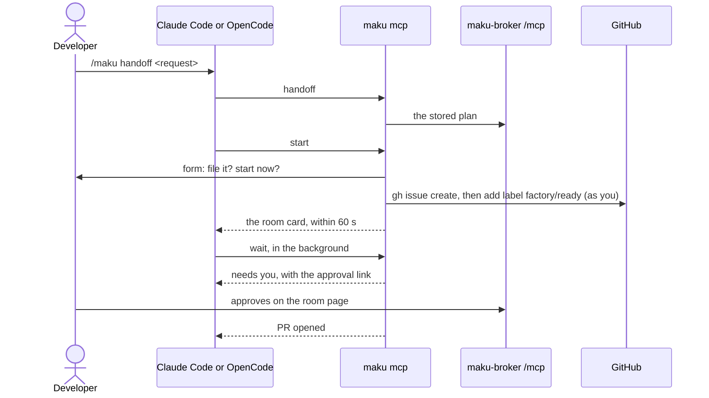

# 19 — The factory from your coding agent: the live proofs

Proves feature 13 in Claude Code and in OpenCode: a developer hands a side task to the factory from
the session, follows it to an approval, and brings the branch back. Design:
[the factory from your coding agent](../../superpowers/specs/2026-10-25-factory-from-your-agent-design.md)
(its Gate lists the five proofs below), now on the six-tool Maku surface
([runbook 27](27-six-tools-and-slack-acts.md)): `handoff`, `start`, `inbox`, `task`, `wait`, `answer`
and the `/maku` verbs. See [README.md](README.md) for `CLOUD`.

```mermaid
sequenceDiagram
  actor Dev as Developer
  participant A as Claude Code or OpenCode
  participant R as maku mcp
  participant B as maku-broker /mcp
  participant GH as GitHub
  Dev->>A: /maku handoff <request>
  A->>R: handoff
  R->>B: the stored plan
  A->>R: start
  R->>Dev: form: file it? start now?
  R->>GH: gh issue create, then add label factory/ready (as you)
  R-->>A: the room card, within 60 s
  A->>R: wait, in the background
  R-->>A: needs you, with the approval link
  Dev->>B: approves on the room page
  R-->>A: PR opened
```

## 1. Prerequisites

- [ ] **[OWNER]** Maku v0.53.0 or later pinned (`flux/sources/ocirepo-agent-factory.yaml`), the
  six-tool release, with `sessionStart` gone from every broker copy (v0.53.0 refuses the key).
- [ ] `maku` v0.53.0 or later, configured and logged in (`maku doctor`: `dns`, `tls`, `login`, `github` ok).
- [ ] Claude Code and OpenCode installed, each able to run a background subagent.
- [ ] A test repository the factory serves, where the developer can write, and a small `docs` issue to
  file for proof 1.
- [ ] gcp-0 is up and the factory's intake is on (see [runbook 14](14-gcp-0-session.md)).

## 2. The setup

| # | Do | Expected |
|---|---|---|
| 1 | `maku setup claude`, then `maku setup opencode` | Each prints the MCP registration (the client's own `mcp add`, or the snippet to paste) and the skill directory it wrote |
| 2 | `maku doctor` | Every check `ok`, `skill` included |
| 3 | `opencode`'s config after setup | The server sits under `mcp.servers.maku`, the shape `opencode mcp add` writes, and opencode lists it as connected. **Record the opencode version.** A docs-shaped `mcp.factory` that opencode ignores is a FAIL for `setup`'s snippet |
| 4 | In each client, list the MCP tools and prompts | Exactly six tools: `handoff`, `start`, `inbox`, `task`, `wait`, `answer`; the `/maku` verbs `handoff`, `task`, `inbox`. **Record the slash spelling** each client shows (`/maku handoff` in OpenCode, `/maku__maku__handoff` in Claude Code) |

### 2.1 The planner's identity: nothing to write

The planner calls the model gateway (`agent-gateway/model-gateway`) on its `clients` listener, at
`/clients/planner/v1`, with a projected ServiceAccount token of audience `maku-gateway.client.planner`.
The chart mounts that token at `/var/run/secrets/maku/model-gateway/planner` (`broker.modelGateway` in
`infrastructure/base/room-broker/helmrelease.yaml`), and the kubelet rotates it hourly. No key exists, so
there is nothing to seed in OpenBao and nothing to rotate. The `agents/planner` and `apps/planner`
entries an earlier release needed are unused: delete them when convenient.

The gateway admits only `system:serviceaccount:agent-system:room-broker` there and maps the call's
`tier-frontier` to Z.ai `glm-5.3` (`clients.planner` in
`infrastructure/base/agent-gateway/model-gateway/helmrelease.yaml`). A planner that answers 401 or 403
points at the token's audience or the gateway's `broker` values; one that times out points at the
network policies on either side.

## 3. Live proofs

Run each in Claude Code, then in OpenCode. Mark PASS or FAIL per client; a FAIL names what was seen.

| # | Do | Expected | Claude Code | OpenCode |
|---|---|---|---|---|
| 1a | `/maku handoff <one-sentence request>` (either client's slash spelling), with the small `docs` issue | The planner drafts one issue (`handoff`), asking at most one question; a stored plan comes back with its id | | |
| 1b | `start {id}` | The confirmation form shows the issue, the `Workflow` and the `Budget`; the issue is filed as your GitHub login and labelled `factory/ready`; GitHub's timeline shows the developer, not a bot, as the labeller; the room card appears within 60 s | | |
| 1c | In a second session, the model is asked to start the work without the form | No tool argument starts it: `start`'s form is the only path | | |
| 2a | "wait for it" (a background `wait`) | It returns when the run asks an approval, with the card and the approval link; the main session stayed usable meanwhile | | |
| 2b | In a client with URL forms | The URL form opens the room page at the approval, and only for a URL on the rooms host that came from the broker | | |
| 2c | Decide the approval on the room page, then "wait for it" again | The next wait returns on the pull request. Approvals stayed on the room page: no tool in the session approved | | |
| 3a | `/maku task [task or #issue]` | The card shows the runs line and the spend in dollars, with states in words | | |
| 3b | Force a resume (queue a note with `maku post <room> --queue`, or stop and restart the run), then ask for `task` again | The milestones appear; turns and tool calls are collapsed; a second call shows only what is new | | |
| 3c | **L8.** The same card from `task` and `inbox` | The client displays the Markdown `content` text, not the JSON `structuredContent`. If a client shows the JSON instead, record which and FAIL: the view is hidden | | |
| 4a | `maku checkout <room>` in the terminal (the retired `room_checkout` tool now sits behind `maku setup <client> --advanced`) | A new worktree appears beside the repository at the checked commit; the current checkout and its branch are untouched; a second call returns the same path | | |
| 4b | Plant `.opencode/plugins/<file>` in the room's branch (a test branch the factory pushed, or a fork of it), then `maku checkout <room>` | The checkout lists the file and defaults to no; answering no creates nothing | | |
| 5 | Queue a hostile note (`maku post <room> --queue` with a link, a heading, a table row, an ANSI escape and a bidi character in the text), then show the card in both clients | Each appears as a quoted code span: no link, heading or table from the note, no escape in the terminal | | |

### 3.1 Checks collected during the build

| # | Do | Expected | Claude Code | OpenCode |
|---|---|---|---|---|
| a | Sign in with a deliberately wrong client id or a revoked token (`maku login`, then a tool call) | **Record ZITADEL's exact `invalid_client` wording** and what `maku doctor` and the tools return; the fix named must be one that works | | |
| b | Have a reviewer on a test PR delete their GitHub account (or use a known ghost user), then look at the card | **Record the login GitHub's GraphQL returns** for the deleted reviewer (a ghost, or null). The card must not crash or show an empty name | | |

## 4. Claude Code without forms

If Claude Code declares no form mode at `initialize`, proofs 1 and 4 run the no-forms path there and
the result says so:

| Proof | The no-forms path | Expected |
|---|---|---|
| 1 | `start` refuses and tells the agent to show the plan; the developer files it with `gh`, and labels it | Nothing starts without the developer; the card then appears as in 1b |
| 4 | `maku checkout <room>` for a branch with a flagged file | It refuses and names the file; a clean branch still checks out |

Record "no forms" in the user guide's portability table, in the Forms cell.

## 5. Off again

1. Remove the planted `.opencode/plugins/` test branch and the checked-out worktrees
   (`git worktree remove <path>`).
2. In the user guide's portability table (`website/content/docs/platform/ai-platform/agents/use/user-guide.md`),
   the Claude Code and OpenCode Status cells become `proven, <date>`, and fix any cell a proof
   contradicted. In the design's Status line, replace "live proofs wait" with the session's date.
3. File the three recorded wordings (opencode's shape, ZITADEL's `invalid_client`, the deleted
   reviewer's login) where the next reader finds them.
